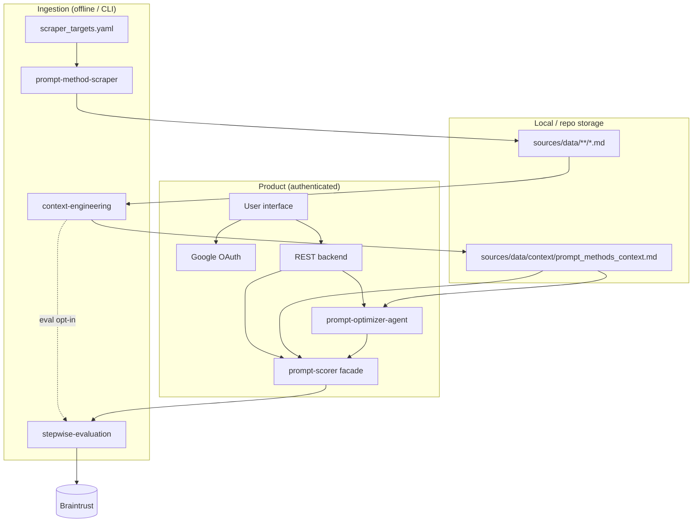

# System Design & Architecture

Feature-specific design lives in **`feature-*.md`** files in this directory. Use this README for **end-to-end architecture**, **per-feature index**, and **cross-cutting contracts** (errors, shared API fields).

## Rendered diagrams (SVG)

Static exports (same content as the Mermaid blocks in this folder): see **[rendered/](rendered/README.md)** — e.g. [rendered/00-system-end-to-end.svg](rendered/00-system-end-to-end.svg).

## Feature index

| Feature | Document |
|--------|----------|
| Context engineering | [feature-context-engineering.md](feature-context-engineering.md) |
| Prompt-method scraper | [feature-prompt-method-scraper.md](feature-prompt-method-scraper.md) |
| Stepwise evaluation (Braintrust) | [feature-stepwise-evaluation.md](feature-stepwise-evaluation.md) |
| Prompt scorer (facade) | [feature-prompt-scorer.md](feature-prompt-scorer.md) |
| Prompt optimizer agent | [feature-prompt-optimizer-agent.md](feature-prompt-optimizer-agent.md) |
| User interface + REST | [feature-user-interface.md](feature-user-interface.md) |

## End-to-end system diagram

**Product** flows run through the **REST backend** → **agent** / **prompt-scorer** → **stepwise-evaluation** → **Braintrust**. **Offline/CLI** paths: **scraper** and **context-engineering** populate `sources/data` and ``prompt_methods_context.md``. When **context eval mode** is enabled, **context-engineering** also calls **stepwise-evaluation** → **Braintrust** (same package as the scorer path).



## Cross-cutting error contract (Python)

All public library surfaces **raise** typed exceptions (no `Result` envelope in MVP). Implement in a single module e.g. ``auto_prompt.errors``; callers catch ``AutoPromptError`` for user-safe messaging.

| Type | When | Typical caller action |
|------|------|------------------------|
| ``ConfigurationError`` | Missing env vars, invalid config files, Braintrust not configured when eval requested | Fix config; fail session setup |
| ``ValidationError`` | Invalid argument (empty prompt, bad ``scorer_name``, malformed upload) | Return 400 + stable code (REST) |
| ``ResourceNotFoundError`` | Missing context file, unknown ``method_id`` / section | Return 404 or agent clarification |
| ``ConcurrencyError`` | Context merge lock not acquired (see context-engineering) | Retry merge or surface “busy” |
| ``DependencyUnavailableError`` | Braintrust or network failure during eval | Retry/backoff; 502 from REST |
| ``ScrapeTargetError`` | Single scrape URL failed (others may succeed) | Log per-URL; optional partial run |

**Rules**

- Do **not** leak secrets or raw stack traces to the UI; log server-side, return ``message`` safe for users.
- **prompt-scorer** and **context-engineering** (eval mode) wrap **stepwise-evaluation** failures: prefer ``DependencyUnavailableError`` or ``ConfigurationError`` when the root cause is Braintrust or env.

## Cross-cutting error contract (REST)

Responses use a stable JSON envelope for failures:

```json
{
  "error_code": "VALIDATION_ERROR",
  "message": "Human-readable summary",
  "detail": {}
}
```

Suggested mapping: ``ValidationError`` → 400; ``ResourceNotFoundError`` → 404; ``ConcurrencyError`` → 409; ``ConfigurationError`` (session config) → 400 or 503; ``DependencyUnavailableError`` → 502; auth failures → 401/403.

## Shared API field: ``scoring_phase``

**prompt-optimizer-agent** and **prompt-scorer** use the same keyword argument for pre/post hook scorers:

- Parameter name: ``scoring_phase``
- Values: ``Literal["before", "after"]``
- Used only on **single-prompt** ``score(...)``. **``compare(...)``** does not take ``scoring_phase``; it evaluates both versions and returns ``ComparisonResult`` (see prompt-scorer design).

---

Per-feature diagrams and additional contracts appear in each **``feature-*.md``** file.
