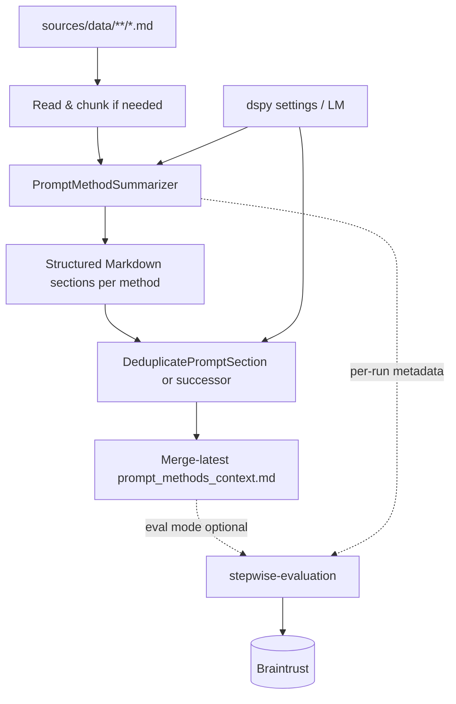

# System Design & Architecture

## Architecture Overview
**What is the high-level system structure?**

- **Ingest:** load text from scraper Markdown; optional chunking for very long files (reuse preprocessing if needed).
- **Summarize:** ``PromptMethodSummarizer`` (DSPy) produces **per-source** structured Markdown (headers + bullets).
- **Dedupe:** cross-source deduplication to produce **one context artifact** with **unique methods and bullets**.
- **Output path (canonical):** single merge file ``sources/data/context/prompt_methods_context.md`` updated by **merging** each run’s new summaries into the existing file, then deduplicating; project data root is ``sources/data``.

## Stepwise evaluation during context build

**stepwise-evaluation** is **usable in the context-engineering phase**: when eval mode is **enabled**, the orchestrator calls the shared **stepwise** layer (``step_id=context_engineering``) so Braintrust receives **EvalRecord**-compatible rows for this run (inputs: source paths and/or raw/snippet inputs; outputs: merged context excerpt or structured summary metadata).

- **Default:** eval mode **off**; ``build-context`` does not import or require Braintrust.
- **Opt-in:** CLI flag and/or environment variable (exact names in implementation); **fail-fast** with ``ConfigurationError`` if eval is requested but Braintrust env is invalid.
- **Blocking vs best-effort:** align with **stepwise-evaluation** NFR (e.g. **non-blocking** log by default, **blocking** eval run if explicitly requested).
- **Ordering:** acquire **merge lock** and finish **atomic write** of ``prompt_methods_context.md`` **before** emitting the CE eval record so Braintrust sees the final merged artifact.

## Concurrency: single writer for context merge

Only **one** process may perform a **read–merge–write** cycle on ``prompt_methods_context.md`` at a time.

- **Lock:** acquire an **exclusive advisory lock** (e.g. sibling file ``sources/data/context/.prompt_methods_context.lock`` or a dedicated lock path) for the whole transaction: read existing file → merge new summaries → dedupe → persist.
- **Atomic publish:** write the updated Markdown to a **temporary file** in the same directory, ``fsync``, then **rename** into ``prompt_methods_context.md`` so readers never see a partial file.
- **Failure:** if the lock cannot be acquired within a **configurable timeout**, raise ``ConcurrencyError`` with a clear message (CLI: non-zero exit; callers may retry).
- **Readers:** concurrent read-only access is allowed; torn reads are avoided by atomic replace. Long-running editors should re-open the file after a merge.

## Error contract

| Exception | When |
|-----------|------|
| ``ValidationError`` | Invalid paths, empty corpus when merge would be no-op, bad CLI args |
| ``ResourceNotFoundError`` | Required input ``.md`` missing when explicitly referenced |
| ``ConfigurationError`` | DSPy/LM config invalid when summarization is enabled; or **eval mode** on but Braintrust / stepwise config invalid |
| ``ConcurrencyError`` | Merge lock **not acquired** within timeout |
| ``DependencyUnavailableError`` | LM/API unreachable when summarization runs (optional thin wrap) |

Skipped or empty inputs are **logged** and skipped per policy; they do not by default abort the whole run unless the caller sets strict mode (implementation detail).

## Data Models
**What data do we need to manage?**

- **Input artifact:** path + raw Markdown string.
- **Intermediate:** `dspy.Prediction` with `summary`, `headers`, `sections` (or evolved shape).
- **Output artifact:** single Markdown string + optional metadata (generated_at, source list).

## API Design
**How do components communicate?**

- **Internal Python API:** classes in `auto_prompt.promptymization` (e.g. ``PromptMethodSummarizer``, `DeduplicatePromptSection`, `PromptMethodsContext`).
- **CLI / script entry:** “build context from `sources/data`”; optional **eval** switch delegates to **stepwise-evaluation** (see above).

## Component Breakdown
**What are the major building blocks?**

- **Summarization signature:** enforces Markdown structure (method headers + rule bullets).
- **Dedup module:** compares new content against **accumulated reference** Markdown; outputs novel headers/bullets only.
- **Orchestrator:** iterates files, chains summarizer → dedupe against running aggregate or reference file; **optional** post-merge call to **stepwise-evaluation** for ``context_engineering``.

## Design Decisions
**Why did we choose this approach?**

- **DSPy modules** match project standards and allow testability via mocks.
- **Two-phase** summarize-then-dedupe keeps responsibilities separate (summarization vs corpus-level uniqueness).
- **CE-phase evals** reuse the **same** **stepwise-evaluation** package as **prompt-scorer**—one Braintrust integration path.

## Non-Functional Requirements
**How should the system perform?**

- Bounded token use: chunk long inputs; configurable limits.
- Deterministic ordering of output sections where possible for diff-friendly reviews.
- Logging of skipped/quiet failures for bad inputs without failing entire run (policy TBD).
- **Merge exclusivity:** single-writer lock + atomic file replace (see **Concurrency** above).
