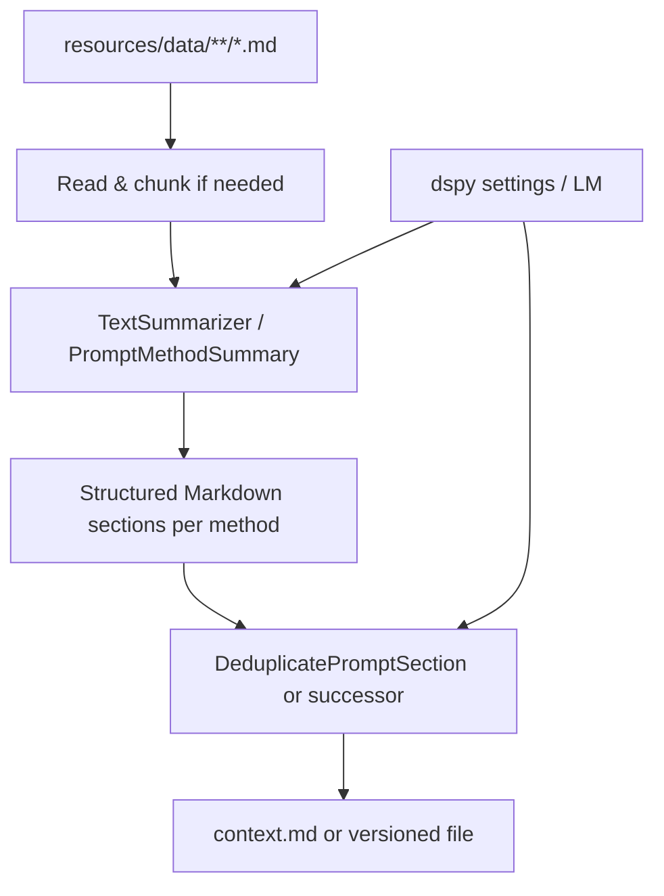

# System Design & Architecture

## Architecture Overview
**What is the high-level system structure?**

- **Ingest:** load text from scraper Markdown; optional chunking for very long files (reuse preprocessing if needed).
- **Summarize:** DSPy module(s) produce **per-source** structured Markdown (headers + bullets).
- **Dedupe:** cross-source deduplication to produce **one context artifact** with **unique methods and bullets**.

## Data Models
**What data do we need to manage?**

- **Input artifact:** path + raw Markdown string.
- **Intermediate:** `dspy.Prediction` with `summary`, `headers`, `sections` (or evolved shape).
- **Output artifact:** single Markdown string + optional metadata (generated_at, source list).

## API Design
**How do components communicate?**

- **Internal Python API:** classes in `auto_prompt.promptymization` (e.g. `TextSummarizer`, `DeduplicatePromptSection`, `PromptMethodsContext`).
- **CLI / script entry** (optional): “build context from `resources/data`.”

## Component Breakdown
**What are the major building blocks?**

- **Summarization signature:** enforces Markdown structure (method headers + rule bullets).
- **Dedup module:** compares new content against **accumulated reference** Markdown; outputs novel headers/bullets only.
- **Orchestrator:** iterates files, chains summarizer → dedupe against running aggregate or reference file.

## Design Decisions
**Why did we choose this approach?**

- **DSPy modules** match project standards and allow testability via mocks.
- **Two-phase** summarize-then-dedupe keeps responsibilities separate (summarization vs corpus-level uniqueness).

## Non-Functional Requirements
**How should the system perform?**

- Bounded token use: chunk long inputs; configurable limits.
- Deterministic ordering of output sections where possible for diff-friendly reviews.
- Logging of skipped/empty inputs without failing entire run (policy TBD).
