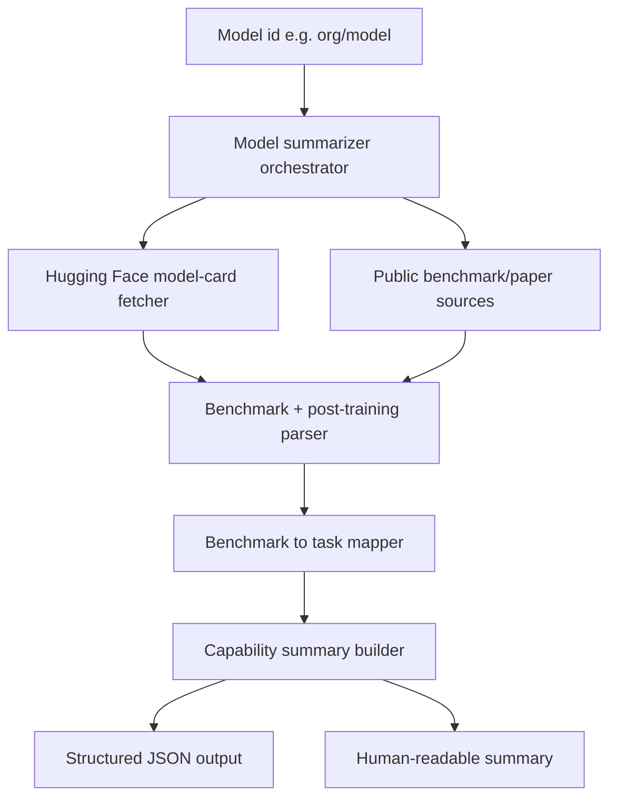

# System Design & Architecture

## Architecture Overview
**What is the high-level system structure?**

- **Orchestrator:** validates model id, coordinates source fetches, and merges evidence.
- **Fetchers:** pull benchmark and post-training information from Hugging Face model cards plus optional public sources.
- **Parser:** extracts benchmark entries (name, score, split/source) and post-training hints (SFT, RLHF, DPO, safety tuning, tool-use tuning).
- **Mapper:** maps benchmark names to task categories using a curated registry.
- **Summary builder:** explains model strengths/limitations based on benchmark + post-training evidence and marks unknowns explicitly.

## Data Models
**What data do we need to manage?**

- **ModelSummaryRequest**
  - `model_id: str` (Hugging Face style `org/model`)
  - optional source flags (e.g. include extra public sources)
- **BenchmarkEntry**
  - `benchmark_name: str`
  - `task_name: str`
  - `score: float | str | None`
  - `source_url: str`
  - `notes: str | None`
- **PostTrainingEntry**
  - `method: Literal["sft", "instruction_tuning", "rlhf", "dpo", "safety_tuning", "tool_use", "other"]`
  - `evidence: str`
  - `source_url: str`
- **ModelSummary**
  - `model_id: str`
  - `benchmarks: list[BenchmarkEntry]`
  - `post_training: list[PostTrainingEntry]`
  - `strengths: list[str]`
  - `limitations: list[str]`
  - `unknowns: list[str]`
  - `summary_markdown: str`

## API Design
**How do components communicate?**

- **Internal Python API (primary):**
  - `summarize_model(model_id: str, *, include_sources: list[str] | None = None) -> ModelSummary`
- **Optional REST integration (for UI):**
  - `POST /v1/models/{model_id}/summary`
  - returns serialized `ModelSummary` JSON for rendering.

## Error contract

| Exception | When |
|-----------|------|
| ``ValidationError`` | Invalid/empty model id |
| ``ResourceNotFoundError`` | Model card not found or no usable benchmark evidence |
| ``DependencyUnavailableError`` | Upstream network/source fetch failures |
| ``ConfigurationError`` | Required source configuration missing (if optional providers are enabled) |

Rules:

- Do not fabricate benchmark scores when unavailable; surface unknowns.
- Keep source links in output for traceability.
- Fail per-source gracefully where possible; return partial summary with explicit gaps when policy allows.

## Component Breakdown
**What are the major building blocks?**

- `model_sources.py`: source-specific fetchers (HF model cards + optional public endpoints).
- `benchmark_registry.py`: benchmark-name to task mapping table.
- `extractors.py`: parse structured benchmark/post-training evidence from source text.
- `summarizer.py`: capability synthesis and markdown summary generation.

## Design Decisions
**Why did we choose this approach?**

- **Source-first + evidence links:** users can inspect where each claim comes from.
- **Task mapping registry:** benchmark scores are more useful when translated into task intent.
- **Graceful degradation:** public metadata is noisy/incomplete; unknowns are first-class output.

## Non-Functional Requirements
**How should the system perform?**

- Deterministic outputs for identical source snapshots where practical.
- Bounded network timeouts and clear source-level failure reporting.
- No hidden caching assumptions; if caching is added, expose refresh behavior.

