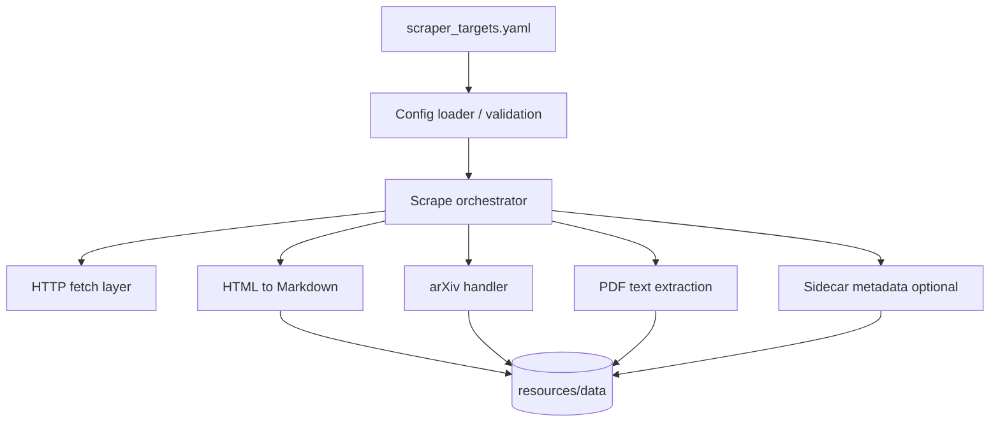

# System Design & Architecture

## Architecture Overview
**What is the high-level system structure?**

- **Config loader:** reads `scraper_targets.yaml`, resolves `folder_name` → base path under `resources/data`.
- **Orchestrator:** dispatches each URL to the right handler (blog/HTML, arXiv, PDF).
- **Storage:** writes Markdown (and optional JSON/metadata) under `resources/data/<folder_name>/...`.

## Data Models
**What data do we need to manage?**

- **Target:** `folder_name`, list of `url` strings (existing YAML shape; extend if needed for type hints or options).
- **Artifact:** Markdown file(s), optional `meta.json` (URL, fetched_at, content_type, source).
- **Paths:** stable relative paths from `resources/data` for reproducibility.

## API Design
**How do components communicate?**

- **Internal:** Python functions/classes (e.g. existing `scraper` package); single public “run scrape” entry for CLI/Makefile.
- **External:** HTTP(S) only; no new public HTTP API for this feature.

## Component Breakdown
**What are the major building blocks?**

- Config module (YAML load + validation).
- Fetch module (timeouts, retries, user-agent).
- Parsers: HTML→Markdown (existing pipeline), arXiv-specific URL handling, PDF extractor.
- Writer: directory creation, atomic writes where possible.

## Design Decisions
**Why did we choose this approach?**

- **YAML-driven folders:** aligns with current `scraper_targets.yaml` and user story.
- **Markdown as canonical store:** matches downstream `PromptMethodsContext` / summarization.

## Non-Functional Requirements
**How should the system perform?**

- Reasonable timeouts; bounded concurrency optional later.
- No secrets in repo; respect rate limits for repeated runs.
- Clear failure messages per URL.
