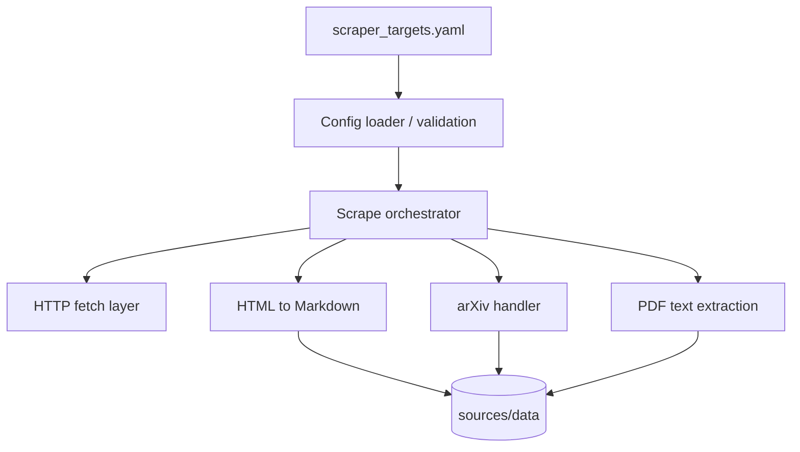

# System Design & Architecture

## Architecture Overview
**What is the high-level system structure?**

- **Implementation:** concrete modules in ``auto_prompt.scraper`` (e.g. ``config``, ``fetch``, ``web_scraper``, ``writer``, ``paths``) with tests; **must** be runnable end-to-end from the repo.
- **Config loader:** reads `scraper_targets.yaml`, resolves `folder_name` → base path under `sources/data`.
- **Orchestrator:** dispatches each URL to the right handler (blog/HTML, arXiv, PDF).
- **Storage:** writes **only** **`.md`** files under `sources/data/<sanitized_folder_path>/...` (YAML `folder_name` segments passed through ``sanitize_folder_name`` / ``resolve_output_dir``; all normalized content as Markdown; no required non-Markdown artifacts).

## Data Models
**What data do we need to manage?**

- **Target:** `folder_name`, list of `url` strings (existing YAML shape; extend if needed for type hints or options).
- **Artifact:** Markdown file(s) **only** (e.g. one ``.md`` per logical page/URL per layout decision).
- **Paths:** stable relative paths from `sources/data` for reproducibility.

## API Design
**How do components communicate?**

- **Internal:** Python functions/classes (e.g. existing `scraper` package); single public “run scrape” entry for CLI/Makefile.
- **External:** HTTP(S) only; no new public HTTP API for this feature.

## Error contract

| Exception | When |
|-----------|------|
| ``ConfigurationError`` | Invalid or missing YAML; unresolvable output root |
| ``ValidationError`` | Malformed target entry |
| ``ScrapeTargetError`` | One URL failed (URL, HTTP status, message); orchestrator may continue with other URLs |
| ``DependencyUnavailableError`` | Persistent network/DNS failure affecting the whole run |

CLI **exit codes:** non-zero if **any** URL failed or config invalid; document partial success (e.g. summary “3/5 ok”) on stderr or structured log.

## Component Breakdown
**What are the major building blocks?**

- Config module (YAML load + validation).
- Fetch module (timeouts, retries, user-agent).
- Parsers: HTML→Markdown (existing pipeline), arXiv-specific URL handling, PDF extractor.
- Writer: directory creation, atomic writes where possible.

## Design Decisions
**Why did we choose this approach?**

- **YAML-driven folders:** aligns with current `scraper_targets.yaml` and user story.
- **Markdown as canonical store:** matches downstream `PromptMethodsContext` / summarization.

## Non-Functional Requirements
**How should the system perform?**

- Reasonable timeouts; bounded concurrency optional later.
- No secrets in repo; respect rate limits for repeated runs.
- Clear failure messages per URL.
