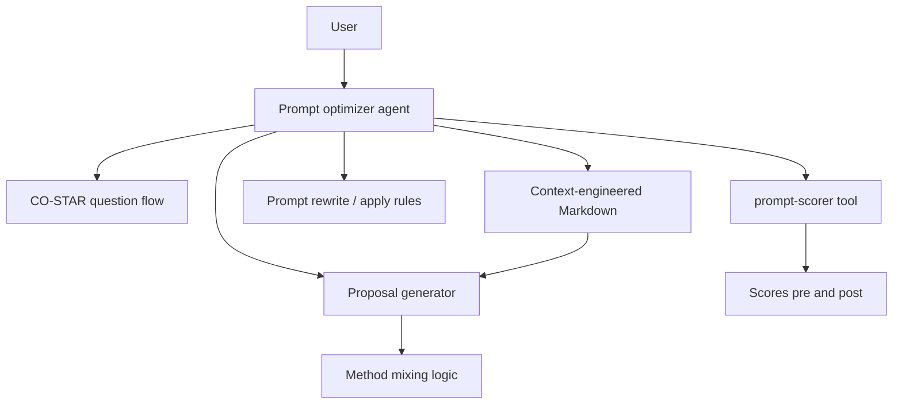

# System Design & Architecture

## Architecture Overview
**What is the high-level system structure?**

- **Agent:** orchestrates dialogue, holds session state (answers, current prompt, proposals).
- **Context:** read-only input from **context-engineering** output (path or content).
- **prompt-scorer:** external tool (separate feature); agent invokes with **prompt text** + optional metadata.

## Data Models
**What data do we need to manage?**

- **Session state:** CO-STAR fields (all optional strings), current `user_prompt`, `last_proposal`, `pending_methods` cited.
- **Context artifact:** Markdown string or file path; may include section headers per prompt method.
- **Scorer I/O:** defined by **`prompt-scorer`** (e.g. score, rationale, dimensions).

## API Design
**How do components communicate?**

- **User ↔ Agent:** chat messages or structured form events (implementation-specific).
- **Agent → prompt-scorer:** function/tool call with `prompt: str`, `phase: "before" | "after"`, optional `session_id`.
- **Agent → context:** file read or injected dependency for testing.

## Component Breakdown
**What are the major building blocks?**

- **Elicitation module:** CO-STAR prompts and validation (optional fields).
- **Retrieval / selection:** map CO-STAR + user prompt to relevant sections in context (LM-assisted or heuristic).
- **Proposal module:** generate 1..N proposals with cited methods; support **mixing** multiple methods.
- **Apply module:** transform user prompt given accepted method rules.
- **Scoring hooks:** two explicit call sites (before / after).

## Design Decisions
**Why did we choose this approach?**

- **Separation of concerns:** scoring lives in **`prompt-scorer`**; this agent only orchestrates.
- **CO-STAR first** aligns user mental model with structured improvement.

## Non-Functional Requirements
**How should the system perform?**

- Responsive turns; avoid redundant scorer calls (policy in implementation).
- No blocking on missing optional CO-STAR fields.
