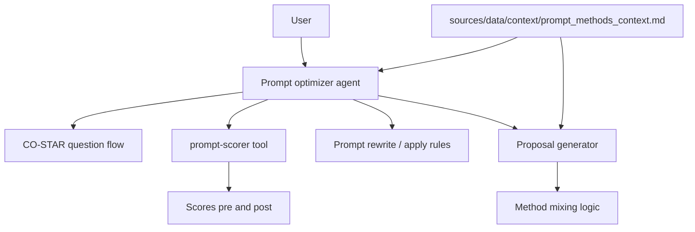

# System Design & Architecture

## Architecture Overview
**What is the high-level system structure?**

- **Agent:** orchestrates dialogue, holds session state (answers, current prompt, proposals).
- **Context file (required):** the agent **loads** ``sources/data/context/prompt_methods_context.md`` at session start (or per request). Proposals **must** be grounded in this file; **no** agent-only mode without the context file for method selection.
- **prompt-scorer:** external tool (separate feature); agent invokes with **prompt text** + optional metadata; scorer also **loads the same context file** when scoring (see **prompt-scorer** design).

## Data Models
**What data do we need to manage?**

- **Session state:** CO-STAR fields (all optional strings), current `user_prompt`, `last_proposal`, `pending_methods` cited.
- **Context artifact:** Markdown string or file path; may include section headers per prompt method.
- **Scorer I/O:** defined by **`prompt-scorer`** (e.g. score, rationale, dimensions).

## API Design
**How do components communicate?**

- **User ↔ Agent:** chat messages or structured form events (implementation-specific).
- **Agent → prompt-scorer:** function/tool call aligned with **prompt-scorer** (see [feature-prompt-scorer.md](feature-prompt-scorer.md)):
  - ``score(prompt: str, scoring_phase: Literal["before", "after"], scorer_name: str, context_path: Path | None = None, method_id: str | None = None, session_id: str | None = None, ...)``
  - Use ``compare(prompt_before, prompt_after, scorer_name=..., ...)`` when the UI or flow needs side-by-side scores (no ``scoring_phase`` on ``compare``).
- **Agent → context:** file read or injected dependency for testing.

## Error contract

| Exception | When |
|-----------|------|
| ``ResourceNotFoundError`` | Context file missing at session start |
| ``ValidationError`` | Bad user input that prevents a turn |
| (Propagated from scorer) | **ConfigurationError**, **DependencyUnavailableError**, etc. — agent surfaces a safe message |

The agent **does not** call Braintrust directly; scorer errors are **user-recoverable** messages where possible (retry, change prompt, fix config).

## Component Breakdown
**What are the major building blocks?**

- **Elicitation module:** CO-STAR prompts and validation (optional fields).
- **Retrieval / selection:** map CO-STAR + user prompt to relevant sections in context (LM-assisted or heuristic).
- **Proposal module:** generate 1..N proposals with cited methods; support **mixing** multiple methods.
- **Apply module:** transform user prompt given accepted method rules.
- **Scoring hooks:** two explicit call sites that invoke ``PromptScorer.score`` with ``scoring_phase="before"`` and ``scoring_phase="after"`` (not ``compare`` unless the flow is explicitly a side-by-side comparison).

## Design Decisions
**Why did we choose this approach?**

- **Separation of concerns:** scoring lives in **`prompt-scorer`**; this agent only orchestrates.
- **CO-STAR first** aligns user mental model with structured improvement.

## Non-Functional Requirements
**How should the system perform?**

- Responsive turns; avoid redundant scorer calls (policy in implementation).
- No blocking on missing optional CO-STAR fields.
