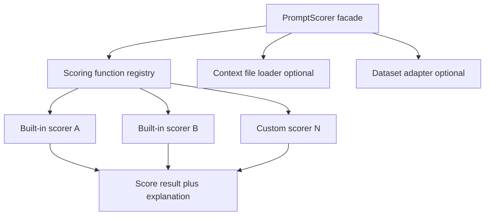

# System Design & Architecture

## Architecture Overview
**What is the high-level system structure?**

- **Facade class** (name TBD, e.g. `PromptScorer`): single entry for `score` and `compare`.
- **Scoring functions** implement a common interface: inputs include **prompt**, optional **dataset slice**, optional **context** (Markdown summarizing methods), **selected method** identifier.
- **Registry:** map string keys to scorer implementations; supports **user extension**.

## Data Models
**What data do we need to manage?**

- **`ScoreResult`:** numeric or structured scores, **explanation** text or structured reasons, **metadata** (scorer id, version).
- **`ComparisonResult`:** two `ScoreResult`s plus **deltas** and optional summary explanation.
- **Dataset:** abstract iterator or table (design picks concrete type); **optional**.

## API Design
**How do components communicate?**

- **Python API** primary; **`prompt-optimizer-agent`** calls into this module as a **tool** with stable kwargs.
- Example sketch (not final):

  - `score(prompt, *, scorer_name, context=None, dataset=None, method_id=None) -> ScoreResult`
  - `compare(prompt_before, prompt_after, *, ...) -> ComparisonResult`

## Component Breakdown
**What are the major building blocks?**

- **`ScorerProtocol` / base class:** `evaluate(...) -> ScoreResult`.
- **`PromptScorer`:** orchestrates validation, loads context if path given, dispatches to scorer.
- **Dataset adapters:** convert file or in-memory data to scorer-specific batches.
- **Explainers:** optional layer that turns raw signals into human-readable explanations (could be part of each scorer).

## Design Decisions
**Why did we choose this approach?**

- **Registry pattern** for extensibility without modifying core each time.
- **Context-only path** avoids forcing users to have gold data for exploratory prompt work.

## Non-Functional Requirements
**How should the system perform?**

- Deterministic scorers should be **deterministic**; LLM scorers should log model/version in metadata.
- Fail fast on invalid `method_id` or missing context sections when required by scorer.
