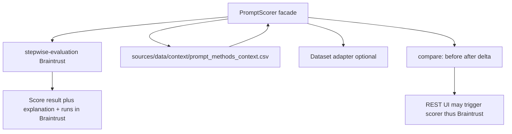

# System Design & Architecture

## Architecture Overview
**What is the high-level system structure?**

- **Facade class** (name TBD, e.g. `PromptScorer`): single entry for `score` and `compare`; **must execute scoring via stepwise-evaluation (Braintrust)** as the required backend path—no parallel local-only backend in production mode.
- **Context file (required for agent-aligned scoring):** default path ``sources/data/context/prompt_methods_context.csv`` when no other context is passed; scorer filters by target ``model_type`` (plus ``all`` rows) and reconstructs markdown context before scoring. Dataset remains optional.
- **Registry / profiles:** map string keys to **Braintrust-backed** eval configurations or thin wrappers; **extension** adds new eval profiles, not parallel metric stacks.
- **`compare(prompt_before, prompt_after, ...)`** returns **both** ``ScoreResult`` objects **and** **deltas**; the **user-interface** displays **score A**, **score B**, **explanations for each**, and **delta** side by side and may **trigger** Braintrust via this facade.

## Data Models
**What data do we need to manage?**

- **`ScoreResult`:** numeric or structured scores, **explanation** text or structured reasons, **metadata** (scorer id, version).
- **`ComparisonResult`:** two `ScoreResult`s plus **deltas** and optional summary explanation.
- **Dataset:** abstract iterator or table (design picks concrete type); **optional**.

## API Design
**How do components communicate?**

- **Python API** primary; **`prompt-optimizer-agent`** calls into this module as a **tool** with stable kwargs aligned with the agent (see **Shared ``scoring_phase``** in [README.md](README.md)).
- **Canonical signatures (implementation target):**

  - `score(prompt, *, scoring_phase: Literal["before", "after"], scorer_name: str, context_path: Path | None = None, dataset: DatasetRef | None = None, method_id: str | None = None, session_id: str | None = None) -> ScoreResult` — if ``context_path`` omitted, default to ``sources/data/context/prompt_methods_context.csv``. ``scoring_phase`` is **required** so Braintrust rows and agent telemetry stay consistent (“before” vs “after” apply).
  - `compare(prompt_before, prompt_after, *, scorer_name: str, context_path: Path | None = None, dataset: DatasetRef | None = None, method_id: str | None = None, session_id: str | None = None) -> ComparisonResult` — **does not** take ``scoring_phase``; runs evals for **both** prompts and returns **before** / **after** ``ScoreResult``s, **deltas**, and optional **summary** explanation for UI + REST.

## Error contract

| Exception | When |
|-----------|------|
| ``ValidationError`` | Empty prompt, unknown ``scorer_name``, invalid ``scoring_phase`` (only on ``score``) |
| ``ResourceNotFoundError`` | Default or explicit ``context_path`` missing; ``method_id`` section not in context |
| ``ConfigurationError`` | Stepwise / Braintrust not configured |
| ``DependencyUnavailableError`` | Braintrust or network failure during eval |

The facade **does not** swallow stepwise errors: translate to the table above where possible and preserve a **chain** for logging.

## Component Breakdown
**What are the major building blocks?**

- **`PromptScorer` facade:** validates inputs, resolves default ``sources/data/context/prompt_methods_context.csv``, filters by ``model_type`` / ``method_id``, maps prompts into **stepwise-evaluation** eval records, returns ``ScoreResult`` / ``ComparisonResult`` for callers.
- **stepwise-evaluation:** **Braintrust** SDK client, step registry, eval profiles—the **only** place Braintrust is implemented for product evals.
- **Dataset adapters:** convert uploaded or file-based data into rows passed to stepwise-evaluation.
- **Extension:** new “scorers” are **Braintrust eval configurations** or thin wrappers—**not** duplicate metric stacks inside **prompt-scorer**.

## Design Decisions
**Why did we choose this approach?**

- **Single Braintrust integration** in **stepwise-evaluation**; **prompt-scorer** stays a stable API for agent/UI.
- **Context-only path** avoids forcing users to have gold data for exploratory prompt work.

## Non-Functional Requirements
**How should the system perform?**

- Deterministic scorers should be **deterministic**; LLM scorers should log model/version in metadata.
- Fail fast on invalid ``method_id`` or missing context sections when required by scorer (``ResourceNotFoundError`` or ``ValidationError`` per policy).
