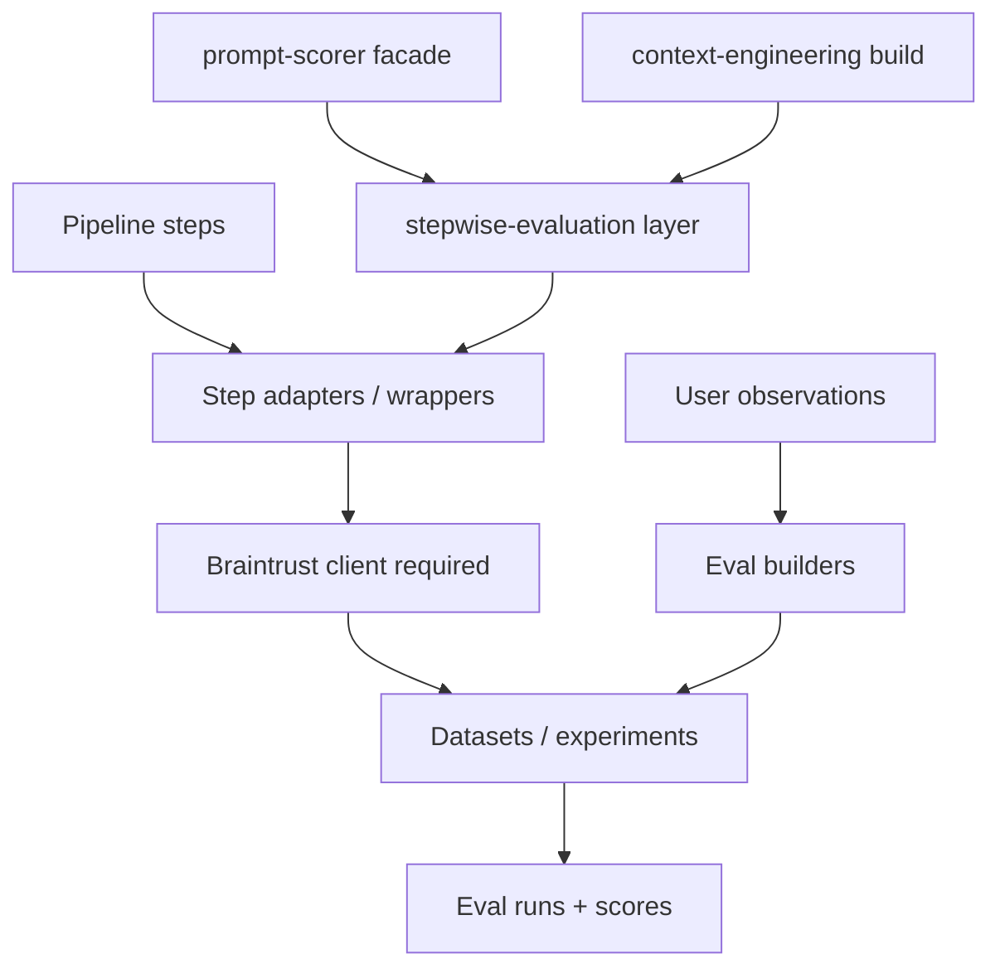

# System Design & Architecture

## Architecture Overview
**What is the high-level system structure?**

- **Steps:** logical units (e.g. **scraper** → **`.md` only**, **context-engineering** → ``prompt_methods_context.md``, **agent** turn, **end-to-end** user session). Stepwise evaluation is **general**: any intermediate step during development, not only final prompt scoring.
- **context-engineering** is a **first-party caller**: the **merge pipeline** invokes **stepwise** when **eval mode** is enabled (``step_id=context_engineering``), in addition to **prompt-scorer** and future hooks.
- **Adapters:** thin layer that emits **structured records** (input, output, metadata, `step_id`) suitable for Braintrust logging or dataset rows.
- **Braintrust:** hosts **datasets**, **eval definitions**, and **run results**; scorers may be Braintrust-native or wrapped Python functions per Braintrust docs.

## Data Models
**What data do we need to manage?**

- **`EvalRecord`:** `step_id`, `run_id`, `inputs` (JSON-serializable), `outputs`, `labels` (optional), `notes` (from observations).
- **`StepRegistry`:** maps `step_id` → description, module entrypoints, required fields for eval.
- **Observation import:** schema for “user observed bad output” → **EvalRecord** or Braintrust row.

## API Design
**How do components communicate?**

- **Internal Python API:** e.g. `log_step(...)` / `run_step_eval(step_id, dataset_ref)`—exact names TBD. **Callers include** ``PromptMethodsContext`` / context CLI (CE phase), **prompt-scorer**, and future **scraper** / **agent** hooks.
- **Braintrust API/SDK:** **required** for product eval flows; authentication via **environment variables** listed in **`.env.example`**; no secrets in repo.
- **Optional REST** from future UI: deferred unless **user-interface** feature requires it.

## Error contract

| Exception | When |
|-----------|------|
| ``ConfigurationError`` | Required Braintrust env missing or invalid when an **eval run** is requested |
| ``ValidationError`` | ``step_id`` unknown, ``EvalRecord`` missing required fields |
| ``DependencyUnavailableError`` | Braintrust API errors, timeouts, rate limits (caller may retry) |

**Fail-fast:** configuration checks run when executing an eval, not necessarily at import time. **Non-blocking** ``log_step`` paths may swallow or queue errors per NFR; **blocking** eval runs must surface errors to the **caller** (**prompt-scorer** or **context-engineering** when eval mode is on).

## Component Breakdown
**What are the major building blocks?**

- **`auto_prompt.evaluation` or `auto_prompt.braintrust`** package (name TBD): client setup, step registry, helpers.
- **Per-step hooks:** **context-engineering** wired **inside** the build (eval mode); then **scraping** and other boundaries.
- **Eval builders:** CLI or script to **push** observation files to Braintrust datasets.

## Design Decisions
**Why did we choose this approach?**

- **Braintrust as hub**: avoids building a custom eval UI and matches user request.
- **Stepwise first**: isolates failures; **end-to-end** eval composes or reuses the same primitives.

## Non-Functional Requirements
**How should the system perform?**

- Eval logging must not **block** main pipeline by default (async/best-effort or optional flag).
- Misconfigured **Braintrust** (missing required env) should **fail fast** when an eval run is requested (no committed **SLA** on latency or availability).
