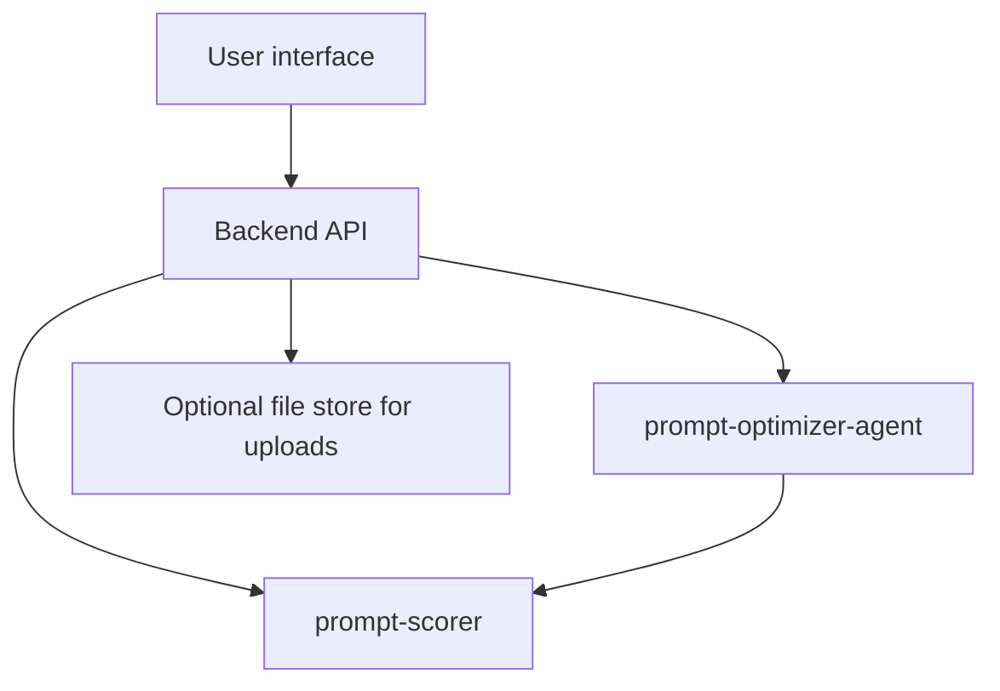

# System Design & Architecture

## Architecture Overview
**What is the high-level system structure?**

- **UI** is the **primary** interaction surface; it talks to a **backend** that wraps the **agent** and **scorer**.
- **Uploads** land in **validated storage** (temp or project-scoped) and are passed by reference to scoring.

## Data Models
**What data do we need to manage?**

- **Session:** conversation id, current prompt text, candidate prompt text, CO-STAR fields (if collected in UI).
- **Score cards:** per prompt version: scores + explanations from **`prompt-scorer`** (`ScoreResult` shape).
- **Upload metadata:** filename, mime, size, parsing status, server-side path or id.

## API Design
**How do components communicate?**

- REST or WebSocket for chat turns (TBD).
- Endpoints sketch:
  - `POST /session` — start
  - `POST /message` — user message / agent reply
  - `POST /prompt/compare` — return two versions + scores
  - `POST /evaluate` — run scorer with optional `dataset_id`
  - `POST /upload` — dataset file

## Component Breakdown
**What are the major building blocks?**

- **Chat / agent panel:** messages, CO-STAR prompts.
- **Prompt editor / diff:** compare old vs new; accept/reject controls.
- **Score panel:** parallel cards for each version with explanations.
- **Upload widget:** drag-drop + validation feedback.

## Design Decisions
**Why did we choose this approach?**

- **UI-first** matches product goal; backend remains testable without UI.
- **Explicit accept/reject** avoids ambiguous “apply” state.

## Non-Functional Requirements
**How should the system perform?**

- Responsive layout; avoid layout shift when scores load.
- Clear loading and error states for scorer and uploads.
