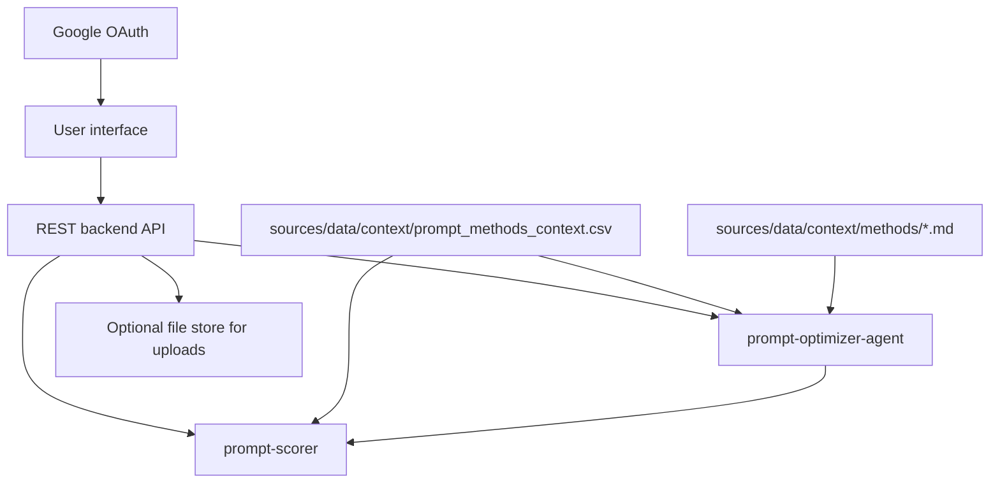

# System Design & Architecture

## Architecture Overview
**What is the high-level system structure?**

- **UI** is the **primary** interaction surface; it talks to a **REST** backend (no WebSocket requirement for MVP).
- **Authentication:** users sign in with **Google** (OAuth 2.0); protected routes call the REST API with session/JWT per implementation.
- **Context file:** backend **loads** ``sources/data/context/prompt_methods_context.csv`` into **both** the agent and scorer for each session or request, applying model-type filtering as required by caller context.
- **Braintrust:** the UI may **trigger** Braintrust-backed evals **through** **prompt-scorer**, which uses **stepwise-evaluation** (single Braintrust integration path).
- **Uploads** land in **validated storage** (temp or project-scoped) and are passed by reference to scoring.

## Data Models
**What data do we need to manage?**

- **Session:** conversation id, current prompt text, candidate prompt text, CO-STAR fields (if collected in UI).
- **Score cards:** per prompt version: scores + explanations from **`prompt-scorer`** (`ScoreResult` shape).
- **Upload metadata:** filename, mime, size, parsing status, server-side path or id.

## API Design
**How do components communicate?**

- **REST only** for MVP: JSON request/response; long-poll or streaming optional later.
- Canonical endpoint naming (all behind **Google-authenticated** sessions except OAuth callback/public health):
  - `POST /auth/google` / OAuth callback — establish session
  - `POST /v1/sessions` — start session (server loads context for agent/scorer)
  - `POST /v1/sessions/{session_id}/messages` — user message / agent reply
  - `POST /v1/steps/{step_id}/execute` — execute one UI-defined step independently
  - `POST /v1/steps/{step_id}/rerun` — rerun previously executed step and return refreshed output
  - `GET /v1/methods` — list available prompt methods for dropdown (id, label, model_type tags)
  - `POST /v1/methods/{method_id}/apply` — apply selected method to current prompt draft
  - `POST /v1/scoring/score` — run ``prompt-scorer.score`` (single prompt)
  - `POST /v1/scoring/compare` — run ``PromptScorer.compare``; returns **before score**, **after score**, **explanations**, **deltas**
  - `POST /v1/uploads/datasets` — upload dataset file for evaluation

**Request alignment with Python APIs**

- Single-prompt eval body should include ``scoring_phase``: ``"before"`` | ``"after"`` when mirroring agent pre/post hooks (same semantics as **prompt-scorer.score**).
- ``POST /v1/scoring/compare`` maps to **prompt-scorer.compare** (no ``scoring_phase`` on the request).
- ``POST /v1/methods/{method_id}/apply`` maps to the agent selected-method apply path and returns transformed prompt text + method metadata.

## Error contract

- All error responses use the shared JSON envelope in [README.md](README.md) (``error_code``, ``message``, ``detail``).
- Map backend exceptions to HTTP status per README; never return Braintrust tokens or stack traces.
- **409** for context merge contention is rare from REST unless the backend triggers merges; **502** for Braintrust outages during ``/v1/scoring/score`` / ``/v1/scoring/compare``.

## Component Breakdown
**What are the major building blocks?**

- **Chat / agent panel:** messages, CO-STAR prompts.
- **Prompt editor / diff:** compare old vs new; accept/reject controls.
- **Method dropdown:** list prompt-engineering methods; selection triggers ``/v1/methods/{method_id}/apply`` and updates current prompt candidate.
- **Score panel:** for **compare** flows, show **both** scores, **each explanation**, and **delta** from ``ComparisonResult`` (same data as ``prompt-scorer.compare``).
- **Upload widget:** drag-drop + validation feedback.

## Design Decisions
**Why did we choose this approach?**

- **UI-first** matches product goal; backend remains testable without UI.
- **Explicit accept/reject** avoids ambiguous “apply” state.

## Non-Functional Requirements
**How should the system perform?**

- Responsive layout; avoid layout shift when scores load.
- Clear loading and error states for scorer and uploads.
